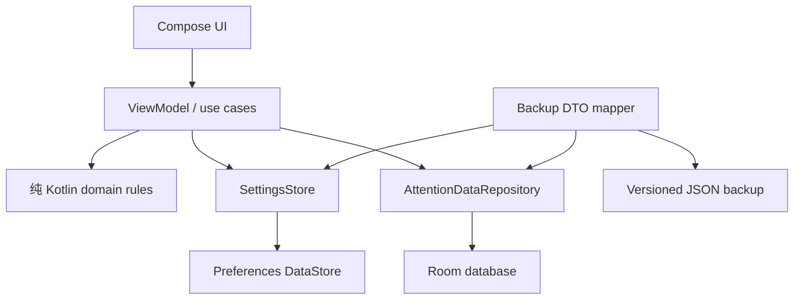

# Room / DataStore 存储架构切换开发方案

状态：Issue #28 已完成 Room 业务写路径、Workspace/ViewModel 与计时入口切换；版本化备份适配、持久化导入前备份和旧 JSON 清理由 #29 完成

## 目标

消除当前“完整 `AttentionState` 写入 Preferences DataStore”与 ADR-0001 之间的冲突：

- Room 成为业务数据的运行时主存储。
- Preferences DataStore 只保存少量应用设置。
- `:domain` 保持纯 Kotlin，不依赖 Android 存储实现。
- 新安装直接使用新架构。
- 本期不自动迁移旧版本 `attention_state_json`，也不承诺已有安装数据保留。

## 当前基线

当前 App 只依赖 `datastore-preferences`，没有 Room 依赖。`DataStoreAttentionStateRepository` 把设置、目标、时间记录、日程、目标阶段、迁移、快照、里程碑和活动计时全部编码到 `attention_state_json`。每次更新都反序列化和重写整份状态。

T01 已经删除了旧的独立设置仓库，解决了两个设置来源并存的问题；本方案继续保留这一统一入口的产品行为，但把持久化边界改为 Room + DataStore。

## 目标架构

### Preferences DataStore

保存：

- `planningDayBoundaryMinutes`
- `weekStartDay`
- `dailyCapacityMinutes`
- `launchDestination`
- `lastOpenedDestination`
- `onboardingCompleted`
- 通知偏好

设置仓库提供类型安全的 `Flow<PlannerSettings>` 和单字段更新方法。设置更新不再通过一个包含全部业务列表的 `AttentionState` 写回。

### Room

第一版数据库实体对应当前领域对象：

- `TargetEntity`
- `GoalStageEntity`
- `TimeEntryEntity`
- `ScheduleEntryEntity`
- `RecurrenceRuleEntity`
- `MigrationEntity`
- `FutureGoalRuleEntity`
- `PeriodSnapshotEntity`
- `TargetMoveEntity`
- `MilestoneEntity`
- `ExperienceEntity`（单例记录）
- `ActiveTimerEntity`（单例记录）

关系和索引至少覆盖：

- 目标的 `parentId`
- 目标阶段的 `targetId`
- 时间记录、日程、重复日程的目标和规则引用
- 迁移记录的来源阶段和目标
- 未来目标规则的目标与阶段
- 周期快照的目标
- 目标移动的目标

删除目标关系时，必须保持当前领域语义：时间记录保留但解除目标关联，日程解除目标关联，目标阶段和目标规则按领域规则处理。不能直接依赖数据库级 CASCADE 替代领域决策。

### 领域与存储适配

保留领域模型和纯 Kotlin 规则。Android 适配层新增：

- Room entity / domain mapper
- DAO 和事务边界
- `SettingsStore`
- `AttentionDataRepository`
- `AttentionStateReader`：组合 Room 流与 DataStore 流，生成 UI 所需的 `AttentionState` 读模型
- JSON backup DTO mapper

当前 `AttentionStateRepository.update(transform)` 不继续作为跨 Room/DataStore 的通用写接口。设置命令和业务命令分别写入各自存储；需要跨存储的导入操作使用明确的协调流程。

## 实现顺序

### 1. 固化边界与依赖

- 保留 ADR-0002 作为本次架构决策。
- 构建工具链锁定 Kotlin 2.4.20、AGP 8.12.2、Gradle 8.13 和 KSP 2.3.12；Room 2.8.5 compiler 通过 KSP 处理 Kotlin 源码。
- 增加 Room runtime、KTX、compiler 和 AndroidX 测试依赖，并导出 Room schema。
- 建立数据库版本、实体包、DAO 包和 mapper 包。
- 为新安装定义空数据库与设置默认值。

### 2. 建立 Room 存储层

- 实现实体、主键、索引、外键和 `AttentionDatabase`。
- 实现每类实体的 DAO 查询和写入。
- 为目标关系、时间记录、日程、计时状态和里程碑建立事务用例。
- 编写数据库重启、事务回滚、外键语义和查询结果测试。
- 旧安装数据不在本期保留范围；Room 仅对已知的 v1/v2 预发布 schema
  使用显式 destructive fallback，并用 instrumentation fixture 验证该策略。未知未来版本不自动清空。

### 3. 拆分设置存储

- 将 `StoredSettings` 的设置字段映射到 Preferences DataStore。
- 将首屏、上次打开页面和引导状态一并移入设置存储。
- 修改 `WorkspaceApp`、`AttentionViewModel`、计时服务和开机接收器，停止直接依赖整份 JSON 状态。
- 保证 T01 的默认值、编辑、清除和重启行为不变。

### 4. 重构读模型与领域命令

- 用 Room DAO 流和 DataStore 流组合出 UI 需要的 `AttentionState`。
- 将 ViewModel 的写操作改为明确命令，命令内部调用纯 Kotlin 领域规则，再以 Room 事务保存结果。
- 计时开始、暂停、恢复、结束和跨规划日拆分必须使用同一数据库事务边界。
- 不让 Compose 层直接拼装数据库实体。

### 5. 重写 JSON 备份适配

- 定义带版本字段的 backup DTO。
- 导出时从 Room 和 DataStore 组合生成 DTO。
- 合并导入和清空恢复分别定义事务语义。
- 导入前生成备份；导入失败时不得留下半套 Room/DataStore 状态。
- 旧 `attention_state_json` 不自动迁移；新架构只支持新格式备份导入。

### 6. 清理旧实现与发布验证

- 删除 `DataStoreAttentionStateRepository` 的运行时主路径和旧 key。
- 删除不再适用的整份 JSON round-trip 存储测试，替换为 Room/DataStore 集成测试。
- 在干净安装、进程重启、计时服务重启和无网络环境中验证。
- 发布说明明确：本版本不自动保留旧安装的本地 JSON 数据。

## 交付拆分

Issue 之间按下列依赖执行：

1. [#25 T22 Room 与 DataStore 架构基础](https://github.com/magician336/attention/issues/25)
2. [#26 T23 Room 业务数据层与事务](https://github.com/magician336/attention/issues/26)
3. [#27 T24 DataStore 设置仓库与组合读模型](https://github.com/magician336/attention/issues/27)
4. [#28 T25 ViewModel、UI 与计时服务切换到 Room](https://github.com/magician336/attention/issues/28)
5. [#29 T26 Room/DataStore 备份适配与旧存储清理](https://github.com/magician336/attention/issues/29)

每个 Issue 必须能独立运行自己的测试；后一个 Issue 不得偷偷承担前一个 Issue 未定义的迁移语义。

## 明确不在本期范围

- 不自动读取、转换或删除已有安装中的 `attention_state_json`。
- 不为旧版本提供无损升级或回滚。
- 不在本方案中新增云同步、账号或跨平台存储。
- 不改变目标、时间记录、规划日和奖励的领域规则。

## 验收矩阵

- 新安装：Room 为空，设置默认值为 03:00、周一、无每日容量、今天首屏。
- 设置：修改、清除、重启后保持；无网络可用。
- 目标与时间记录：新增、编辑、删除关系、查询和重启后保持。
- 计时：开始、暂停、恢复、结束、跨规划日拆分和进程恢复通过测试。
- JSON：新格式导出、合并导入、清空恢复、失败回滚和备份通过测试。
- 数据库：Room schema、DAO、事务、外键语义和版本迁移测试通过。
- 工程：`test lintDebug assembleDebug connectedDebugAndroidTest` 通过。
